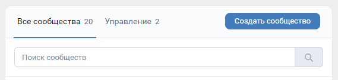

# Что такое Canary Bot?

Canary Bot (или её рабочее название - Каня) - чатбот, работавший в 2020 году внутри одноимённого сообщества ВКонтакте. Целью этого бота было упрощение менеджмента беседы сообщества, а также проводку некоторых развлекательных функций. 

[Test Canary Bot](https://github.com/kensoi/pycanarykit) - фреймворк, основанный на Canary Bot

## Установка CanaryBot в вашем сообществе ВКонтакте  

### 0. Создайте сообщество ВКонтакте  
Перейдите во вкладку Сообщества внутри вашего браузера, или используйте ссылку [vk.com/groups](https://vk.com/groups)  

  

### 1. Перейдите в раздел для работы с API  
Перейдите во вкладку "Управление" при помощи первой ссылки в админ-меню вашего сообщества  

  

Перейдите во вкладку "Работа с API"

### 2. Создайте токен

В шапке раздела нажмите на "Создать ключ"  

  

Выберите необходимые права для вашего токена, затем нажмите "Создать" и подтвердите свою личность.  

  

### 3. Настройте Long Poll сервер

В шапке раздела нажмите "Long Poll API".  
Во вкладке "Настройки" включите пункт "Long Poll API" и выберите нужную версию API.  
Во вкладке "Типы событий" выберите нужные типы, которые будут обрабатываться чат-ботом. Обязательно включите "Входящие сообщения".  

### 4. Клонируйте CanaryBot к себе на компьютер/сервер

Клонируем при помощи Git, но можно скачать в виде архива  

```bash
git clone https://github.com/kensoi/pycanarybot.git
cd pycanarybot
git checkout main
```

### 5. Запуск бота.

Откройте корневой файл репозитория, вставьте созданный токен и id вашего сообщества. Запустите корневой файл. Готово!
